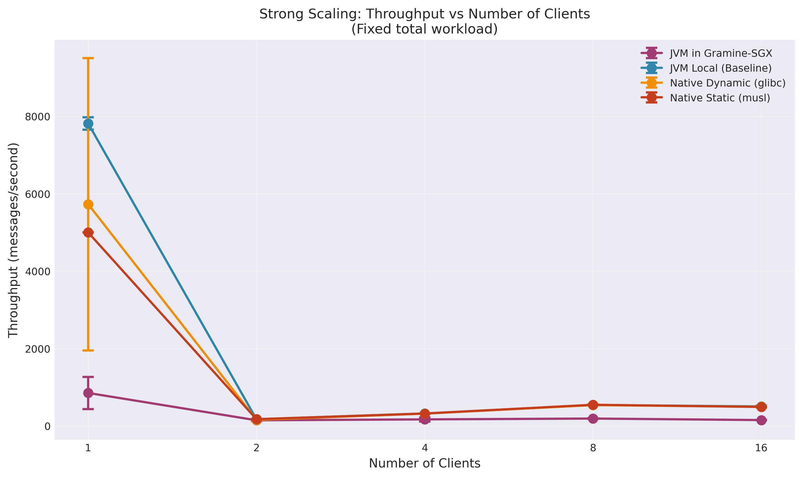
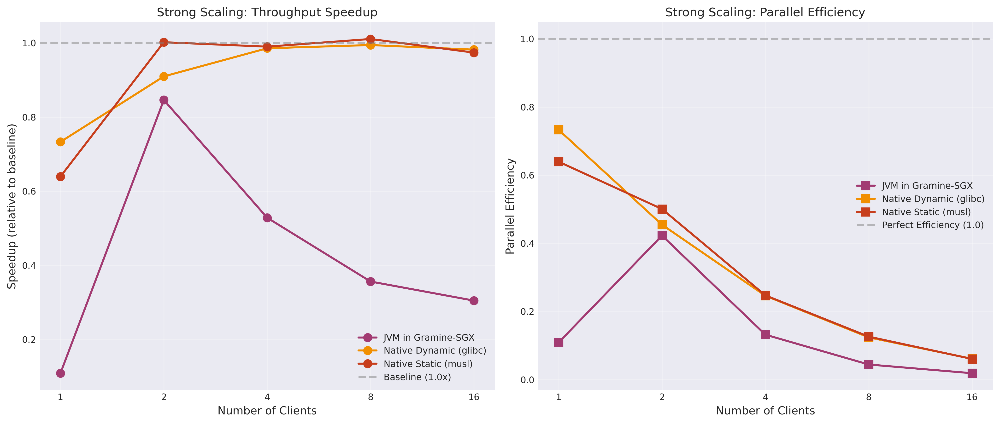
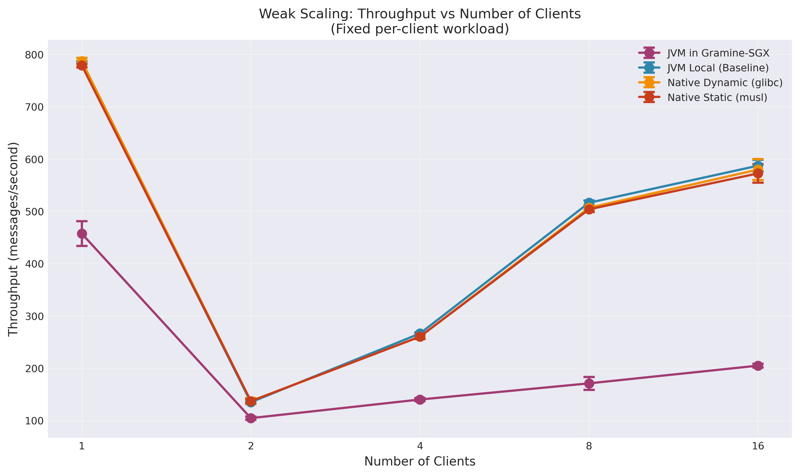
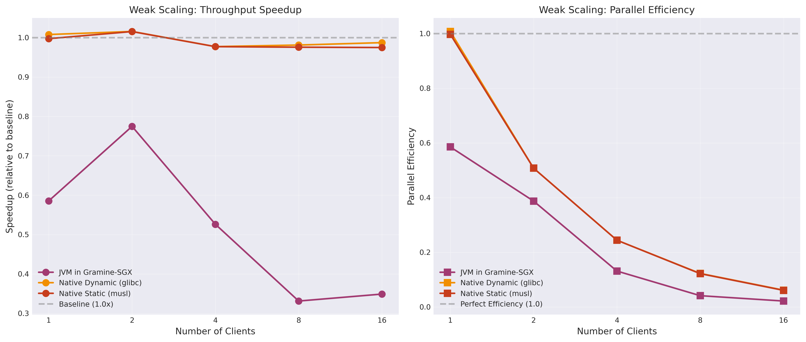
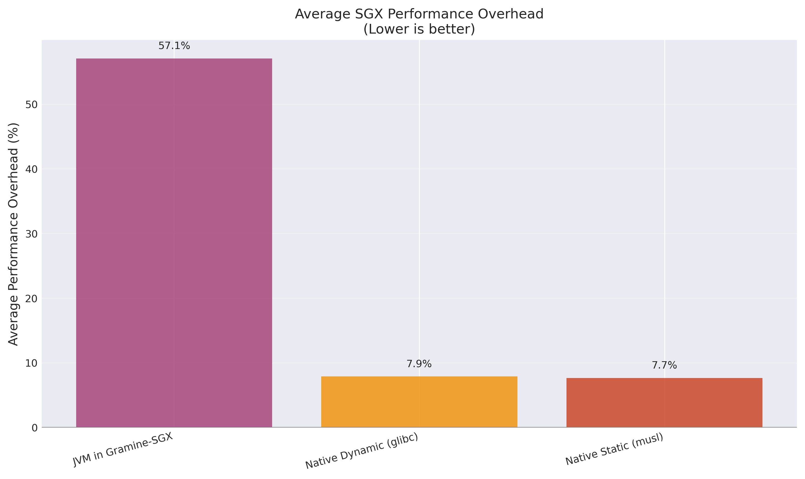

# TLS Benchmark Server for Gramine-SGX

A comprehensive study measuring the performance overhead of deploying Java applications inside SGX enclaves using Gramine. This benchmarking suite compares four execution environments: native JVM (baseline), JVM in Gramine-SGX, and GraalVM native images (dynamic and static) in Gramine-SGX.

## Overview

This project performs a scaling analysis of a multi-threaded TLS server, measuring performance across different confidential computing configurations. The server performs typical stream processing operations including CRC32 checksums, data transformation, pattern matching, and statistical analysis—all within hardware-encrypted SGX enclave memory.

## Scaling Analysis Results

Comprehensive benchmarks analyzing **strong scaling** (fixed workload) and **weak scaling** (fixed per-client workload) across four server variants reveal significant performance characteristics and SGX overhead patterns.

### Test Configurations

| Variant | Description | Startup Time | Overhead |
|---------|-------------|--------------|----------|
| **jvm-local** | JVM on native hardware (baseline) | 3.22s | — |
| **jvm-gramine** | JVM inside Gramine-SGX | 65.22s | +1925% |
| **native-dynamic** | GraalVM native (glibc) in SGX | 135.61s | +4109% |
| **native-static** | GraalVM native (musl) in SGX | 132.44s | +4011% |


*Figure 1: Server startup time comparison across variants*

### Strong Scaling Results (Fixed Total Workload: 1000 messages)

Strong scaling measures how performance changes when distributing a fixed workload across increasing numbers of clients.


*Figure 2: Strong scaling throughput comparison*


*Figure 3: Strong scaling speedup and parallel efficiency*

**Key Findings:**

| Clients | JVM Local | JVM Gramine | Native Dynamic | Native Static |
|---------|-----------|-------------|----------------|---------------|
| 1 | 7,815 msg/s | 855 msg/s (11%) | 5,731 msg/s (73%) | 5,000 msg/s (64%) |
| 2 | 177 msg/s | 149 msg/s (85%) | 161 msg/s (91%) | 177 msg/s (100%) |
| 4 | 326 msg/s | 172 msg/s (53%) | 322 msg/s (99%) | 323 msg/s (99%) |
| 8 | 544 msg/s | 194 msg/s (36%) | 541 msg/s (99%) | 550 msg/s (101%) |
| 16 | 507 msg/s | 155 msg/s (31%) | 498 msg/s (98%) | 494 msg/s (97%) |

*Percentages show speedup relative to JVM baseline*

### Weak Scaling Results (Fixed Per-Client Workload: 100 messages)

Weak scaling measures how performance changes when workload scales proportionally with client count.


*Figure 4: Weak scaling throughput comparison*


*Figure 5: Weak scaling speedup and parallel efficiency*

**Key Findings:**

| Clients | JVM Local | JVM Gramine | Native Dynamic | Native Static |
|---------|-----------|-------------|----------------|---------------|
| 1 | 781 msg/s | 457 msg/s (59%) | 787 msg/s (101%) | 779 msg/s (100%) |
| 2 | 135 msg/s | 105 msg/s (77%) | 137 msg/s (102%) | 137 msg/s (102%) |
| 4 | 266 msg/s | 140 msg/s (53%) | 260 msg/s (98%) | 260 mg/s (98%) |
| 8 | 516 msg/s | 171 msg/s (33%) | 507 msg/s (98%) | 504 msg/s (98%) |
| 16 | 587 msg/s | 205 msg/s (35%) | 580 msg/s (99%) | 573 msg/s (97%) |

*Percentages show speedup relative to JVM baseline*

### Analysis & Recommendations


*Figure 6: Average SGX performance overhead by variant*

Detailed results available in `scaling-results/*/scaling_report.txt`.

## Architecture

**Server** (`src/server/BenchServer.java`)
- Multi-threaded TLS server with configurable thread pool
- Simulates real-world stream processing workloads
- Returns detailed acknowledgments with processing metrics

**Client** (`src/client/BenchClient.java`)
- Single-client and load-testing modes
- Latency and throughput measurement
- Configurable concurrency and message counts

## Quick Start

### Prerequisites

**Option 1: Using the included devcontainer (Recommended)**

This project includes a preconfigured devcontainer with all dependencies installed. Simply open the project in VS Code or any IDE that supports devcontainers, and you'll have everything ready to go:
- Java Development Kit
- Gramine with SGX support
- GraalVM for native image builds
- All build tools and dependencies

Alternatively, use the included [go-task](https://taskfile.dev/) commands (requires Node.js and `devcontainer-cli`):

```bash
# Build, start, and attach to devcontainer
task devcontainer

# Recreate devcontainer from scratch
task devcontainer-recreate

# Stop and remove devcontainer
task devcontainer-down
```

**Option 2: Manual setup**
- Java 8 or later
- Gramine with SGX support
- Intel CPU with SGX enabled
- (Optional) GraalVM for native image builds

### Build Options

#### Option 1: JVM Build (Default)
```bash
# Generate self-signed certificates
./tools/generate-certs.sh

# Compile Java sources and build SGX manifest
make clean all SGX=1
```

#### Option 2: Native Images with GraalVM

For faster startup and lower memory footprint, use GraalVM native images:

**Dynamic build (recommended - better SGX compatibility):**
```bash
make clean
make APP_NAME=native-bench-dynamic STATIC_NATIVE=0 SGX=1 all
```

**Static build (self-contained):**
```bash
make clean
make APP_NAME=native-bench-static STATIC_NATIVE=1 SGX=1 all
```

### Run Server

**Normal JVM:**
```bash
java -cp target/classes server.BenchServer --port 8443
```

**Gramine-SGX (JVM):**
```bash
sudo gramine-sgx bench -cp /app/classes server.BenchServer --port 8443
```

**Gramine-SGX (Native Image - Dynamic):**
```bash
sudo gramine-sgx native-bench-dynamic
```

**Gramine-SGX (Native Image - Static):**
```bash
sudo gramine-sgx native-bench-static
```

### Run Client

Single client:
```bash
java -cp target/classes client.BenchClient \
  --host localhost --port 8443 --messages 100
```

Load test:
```bash
java -cp target/classes client.BenchClient \
  --host localhost --port 8443 \
  --load-test --clients 10 --messages 50
```

## Automated Benchmarking

The benchmark suite performs scientific scaling analysis across all four server variants:

```bash
# Run complete scaling analysis (all 4 variants)
python3 tools/run-benchmarks.py --all

# Run specific variants
python3 tools/run-benchmarks.py --variants jvm-local jvm-gramine

# Customize test parameters
python3 tools/run-benchmarks.py --all \
  --runs 5 \
  --strong-total 2000 \
  --weak-per-client 200

# See all options
python3 tools/run-benchmarks.py --help
```

**Benchmark Types:**
- **Strong Scaling**: Fixed total workload; metrics are captured from the benchmark summary emitted by the client.
- **Weak Scaling**: Fixed per-client workload; metrics are captured from the benchmark summary emitted by the client.

Each execution writes artifacts to `scaling-results/<timestamp>/`:
- `benchmark_results.json` – combined JSON payload with one Teaclave-style summary per variant
- `scaling_results.csv` – flattened CSV containing both strong and weak scaling rows for all variants
- `logs/*.out` – raw client output for auditing (matching `.err` files are emitted if the client prints to stderr)

## Protocol

Clients send newline-terminated text messages. The server responds with:
```
ACK|checksum=<crc32>|size=<bytes>|processing_time_ms=<ms>|status=<status>
```
## References

- [Gramine Documentation](https://gramine.readthedocs.io/)
- [Intel SGX Developer Reference](https://www.intel.com/content/www/us/en/developer/tools/software-guard-extensions/overview.html)
- [Confidential Computing Consortium](https://confidentialcomputing.io/)
