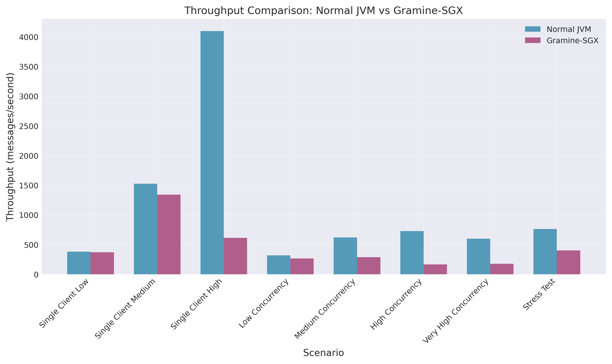
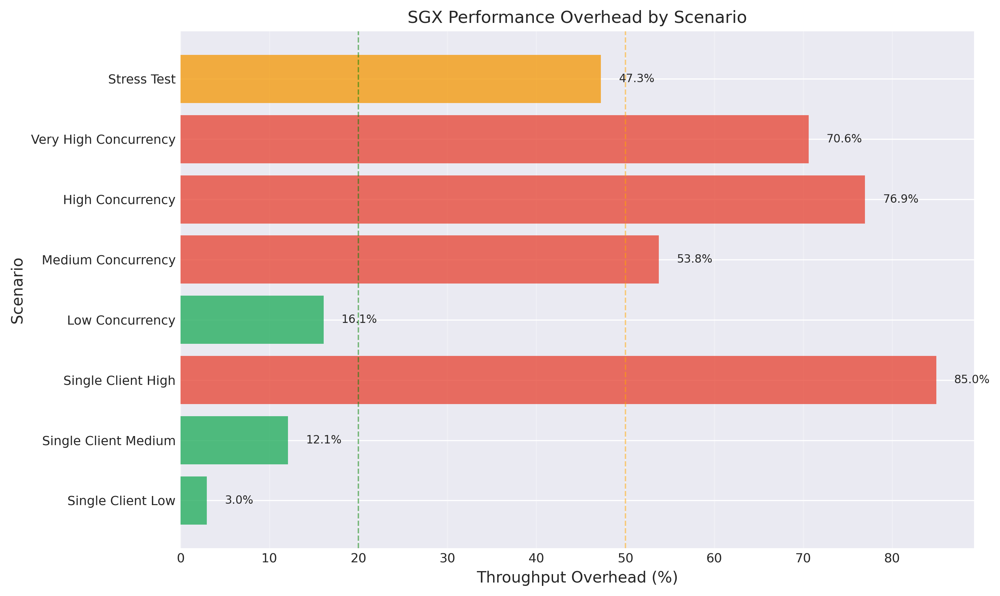
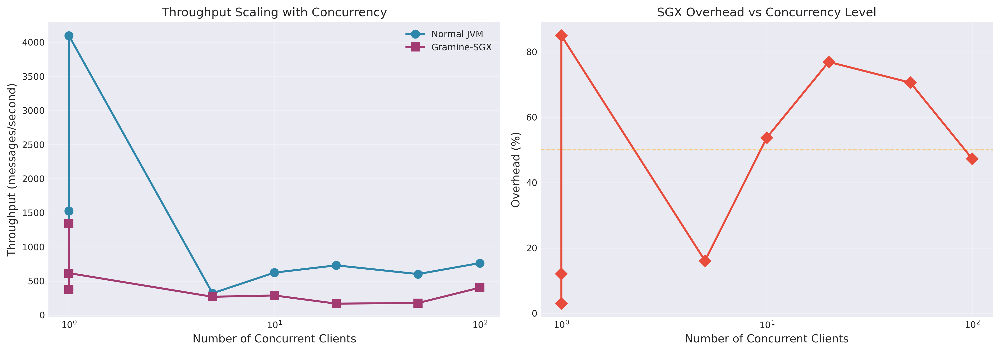
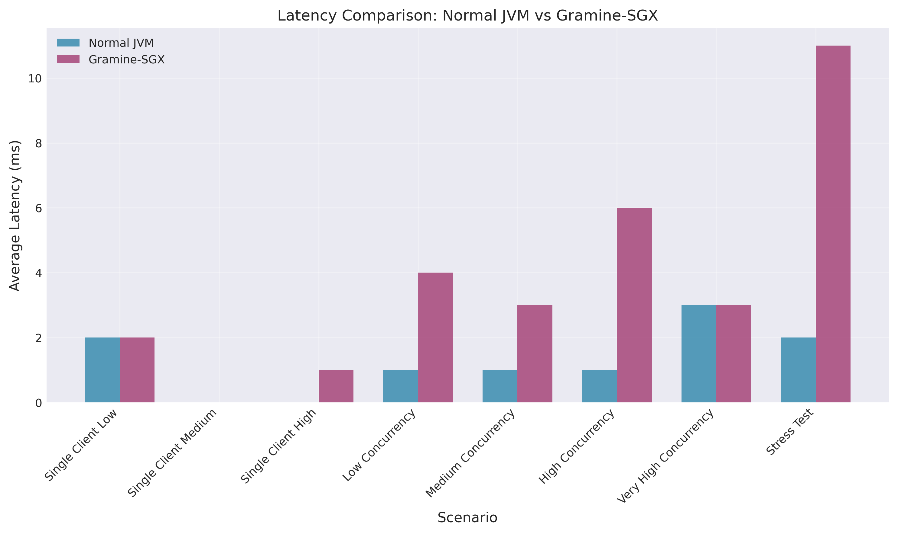

# TLS Benchmark Server for Gramine-SGX

A multi-threaded Java TLS server designed to benchmark the performance overhead of running confidential computing workloads in Intel SGX via Gramine.

## Overview

This project measures the real-world performance impact of running a TLS socket server inside a Trusted Execution Environment (TEE). The server performs typical stream processing operations including CRC32 checksums, data transformation, pattern matching, and statistical analysis—all within the hardware-encrypted memory space of an SGX enclave.

## Performance Results

Comprehensive benchmarks comparing native JVM execution against Gramine-SGX show workload-dependent overhead ranging from 3% to 85%.


*Figure 1: Throughput comparison between normal JVM and Gramine-SGX across different scenarios*


*Figure 2: Performance overhead percentage by workload scenario*

### Key Findings

| Scenario | Normal JVM (msg/s) | SGX (msg/s) | Overhead |
|----------|-------------------|-------------|----------|
| Single client, 50 messages | 381.7 | 370.4 | 3.0% |
| Single client, 200 messages | 1526.7 | 1342.3 | 12.1% |
| Single client, 500 messages | 4098.4 | 615.8 | 85.0% |
| 5 concurrent clients | 320.5 | 269.0 | 16.1% |
| 10 concurrent clients | 623.1 | 288.0 | 53.8% |
| 20 concurrent clients | 729.7 | 168.3 | 76.9% |
| 50 concurrent clients | 601.7 | 176.9 | 70.6% |
| 100 concurrent clients | 763.1 | 402.4 | 47.3% |

### Analysis

**Single-client workloads** show minimal overhead (3-12%) for typical message volumes, but degrade significantly at 500 messages per batch (85% overhead), likely due to enclave memory pressure and EPC paging.

**Concurrent workloads** experience substantial overhead (16-77%) that scales with client count up to 20 clients, then stabilizes. Latency increases by 3-6x under concurrent load.


*Figure 3: Performance scaling analysis with increasing concurrency levels*


*Figure 4: Average latency comparison under different load conditions*

**Recommendation**: Gramine-SGX is well-suited for confidential computing applications with light to moderate workloads (< 10 concurrent clients, < 200 messages per batch) where data privacy requirements justify the performance trade-off.

Detailed analysis and visualizations are available in [BENCHMARKS.md](BENCHMARKS.md).

## Architecture

**Server** (`src/server/BenchServer.java`)
- Multi-threaded TLS server with configurable thread pool
- Simulates real-world stream processing workloads
- Returns detailed acknowledgments with processing metrics

**Client** (`src/client/BenchClient.java`)
- Single-client and load-testing modes
- Latency and throughput measurement
- Configurable concurrency and message counts

## Quick Start

### Prerequisites
- Java 8 or later
- Gramine with SGX support
- Intel CPU with SGX enabled

### Build
```bash
# Generate self-signed certificates
./tools/generate-certs.sh

# Compile Java sources and build SGX manifest
make clean all SGX=1
```

### Run Server

Normal JVM:
```bash
java -cp target/classes server.BenchServer --port 8443
```

Gramine-SGX:
```bash
sudo gramine-sgx bench -cp /app/classes server.BenchServer --port 8443
```

### Run Client

Single client:
```bash
java -cp target/classes client.BenchClient \
  --host localhost --port 8443 --messages 100
```

Load test:
```bash
java -cp target/classes client.BenchClient \
  --host localhost --port 8443 \
  --load-test --clients 10 --messages 50
```

## Automated Benchmarking

The benchmark tool automatically runs comparison tests between normal JVM and Gramine-SGX:

```bash
# Run all benchmark scenarios
./tools/run-benchmarks.py all

# Run specific test
./tools/run-benchmarks.py single
./tools/run-benchmarks.py stress

# Custom parameters
./tools/run-benchmarks.py custom --clients 15 --messages 50

# Generate report from existing results
./tools/run-benchmarks.py report
```

Results are saved to `benchmark-results/` with detailed reports and CSV data.

### Generating Plots

Visualize benchmark results with the plot generation tool:

```bash
# Generate plots from latest benchmark data
./tools/update-plots.sh

# Generate plots from specific CSV file
python3 tools/generate-plots.py benchmark-results/comparison/comparison_data_*.csv --output-dir docs/plots
```

This generates professional PNG plots including throughput comparison, overhead analysis, latency impact, and concurrency scaling visualizations.

## Protocol

Clients send newline-terminated text messages. The server responds with:
```
ACK|checksum=<crc32>|size=<bytes>|processing_time_ms=<ms>|status=<status>
```

## Security Considerations

**Certificates**: The included certificate generation script creates self-signed certificates for benchmarking only. Production deployments should use properly issued certificates or leverage SGX remote attestation for trust establishment.

**Enclave Limitations**: SGX enclaves have limited memory (typically 128-256 MB EPC). Applications exceeding this size will experience severe performance degradation due to paging. Profile your workload to ensure it fits within available enclave memory.

**System Calls**: Each system call requires exiting and re-entering the enclave (8,000-15,000 CPU cycles). Minimize syscalls through batching and async I/O where possible.

## Understanding the Overhead

The performance cost of SGX comes from:
- **Memory encryption**: All enclave memory is encrypted using hardware AES-128
- **Enclave transitions**: System calls require expensive EEXIT/EENTER instructions
- **Limited EPC**: Working sets exceeding enclave page cache trigger paging
- **TLB pressure**: Separate TLB entries for enclave pages increase misses
- **Synchronization overhead**: Enclave-specific lock management

These mechanisms provide hardware-enforced confidentiality and isolation, ensuring even privileged attackers cannot inspect enclave memory.

## License

This is a benchmarking tool for research and evaluation purposes. Use as needed.

## References

- [Gramine Documentation](https://gramine.readthedocs.io/)
- [Intel SGX Developer Reference](https://www.intel.com/content/www/us/en/developer/tools/software-guard-extensions/overview.html)
- [Confidential Computing Consortium](https://confidentialcomputing.io/)