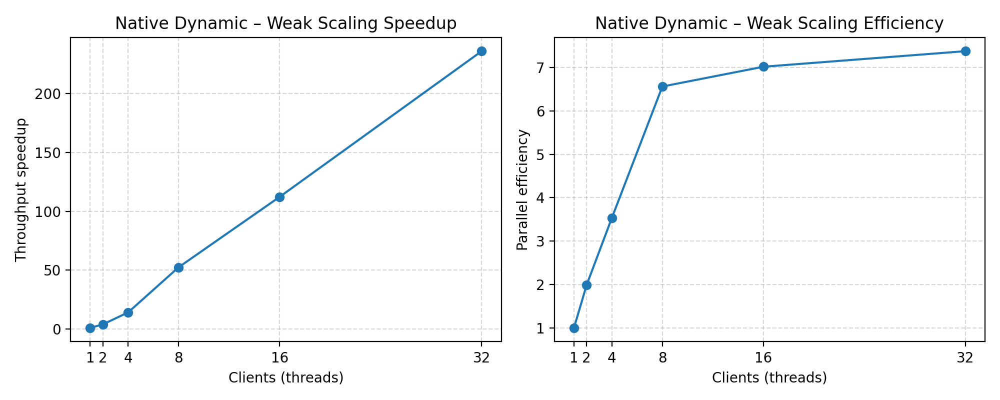

# Gramine Java Benchmark

Benchmark suite that exercises a differentially private binary aggregation tree inside a Gramine-protected JVM. A TLS client streams floating-point values to the TLS enclave; the server keeps the noisy private sum and exposes the same `initBinaryAggregation`, `addToBinaryAggregation`, and `getBinaryAggregationSum` calls that the Java host expects. This repository mirrors the structure used in related aggregation experiments while targeting Gramine rather than relying on ECALL/OCALL support.

## Project Layout

- `src/server/` – TLS server (`com.benchmark.gramine.enclave.BenchServer`) executed inside Gramine. Implements the command protocol (`INIT`, `ADD`, `GET`) and logs each ingestion so the data path can be verified easily.
- `src/server/com/.../dp/BinaryAggregationTree.java` – Gaussian-noise binary aggregation tree used by the server. The code is identical to the companion aggregation experiments, ensuring the same noise model and semantics.
- `src/client/` – Host harness (`com.benchmark.gramine.host.BenchClient`) that prepares weak/strong scaling workloads, drives the TLS service, and prints a JSON summary
- `tools/run-benchmarks.py` – Automation wrapper. Builds each server variant, launches it, runs the client once, and writes combined CSV/JSON artifacts under `scaling-results/<timestamp>/`.
- `tools/generate_plots.py` – Turns the CSV/JSON outputs into PNG plots (per-variant throughput plus combined speedup/efficiency, and a startup-time comparison).

## Benchmark Workflow

Each benchmark execution follows three phases:

1. **Baseline workload** – The client uses `GRAMINE_BENCH_DATA_SIZE` together with the smallest requested thread count to determine the per-thread workload. A warmup pass runs before measurements.
2. **Weak scaling** – The number of worker threads grows while the per-thread workload stays constant.
3. **Strong scaling** – The number of worker threads grows while the total workload stays constant.

The client prints the workload, weak scaling, and strong scaling results as JSON so downstream plotting scripts can consume the output directly.

## Recent Results

Example dataset: `scaling-results/20251030_004543/` (data size = 1024, sigma = 0.5, warmup = 3, measure = 5).

Generate plots:

```bash
python -m venv .venv
source .venv/bin/activate
pip install --upgrade pip matplotlib numpy
python tools/generate_plots.py \
  --results scaling-results/20251030_004543/scaling_results.csv \
  --startup scaling-results/20251030_004543/benchmark_results.json \
  --output plots
```

### Startup time comparison

`tools/generate_plots.py` emits `plots/startup_times.png`, a bar chart that compares the time each server variant spends bootstrapping when launched through Gramine:


### Variant plots

For every non-baseline variant (`jvm-gramine`, `native-dynamic`, `native-static`), the plotting script writes:

- `<variant>_strong_throughput.png`
- `<variant>_strong_speedup_efficiency.png` (speedup and efficiency subplots)
- `<variant>_weak_throughput.png`
- `<variant>_weak_speedup_efficiency.png`

Example (native dynamic variant):




The baseline `jvm-local` data remains in the CSV/JSON outputs for reference but is omitted from the PNGs to avoid clutter.

## Getting Started

### Option 1: Devcontainer (recommended)

1. Install Docker and either the VS Code Dev Containers extension or the `devcontainer` CLI.
2. From the repository root run `task devcontainer` or reopen the folder in a devcontainer.
3. The container provisions GraalVM, Gramine, and the helper scripts.

Common `go-task` entries:

| Task | Description |
|------|-------------|
| `task devcontainer` | Build, start, and attach to the devcontainer. |
| `task devcontainer-up` / `task devcontainer-down` | Manage the container lifecycle without attaching. |
| `task devcontainer-recreate` | Rebuild the environment from scratch. |

### Option 2: Host toolchain

Install the dependencies locally:

- GraalVM (for both the JVM and the `native-image` toolchain)
- Gramine (`gramine`, `gramine-sgx`, `gramine-manifest`)
- GNU Make, Python 3.9+, and OpenJDK support tools

Clone the repository and continue with the build instructions below.

## Building

From the project root:

```bash
# Compile client/server classes
make server client

# Generate TLS certificates (if not already produced)
./tools/generate-certs.sh

# Optional: build GraalVM native images for the TLS server/client set
make APP_NAME=native-bench-dynamic STATIC_NATIVE=0 SGX=1 all
make APP_NAME=native-bench-static STATIC_NATIVE=1 SGX=1 all
```

The automation wrapper (`tools/run-benchmarks.py`) executes `make clean` before building each variant, ensuring every run starts from a known baseline.

## Running Benchmarks

### Manual runs

1. **Start the server (outside SGX):**

   ```bash
   java -cp target/classes com.benchmark.gramine.enclave.BenchServer \
     --port 8443 --keystore server.keystore --password changeit
   ```

2. **Run the client:**

   ```bash
   java -cp target/classes com.benchmark.gramine.host.BenchClient \
     --host localhost --port 8443 \
     --truststore client.truststore --password changeit
   ```

### Automated runs

Execute all server variants and collect results in one go:

```bash
python tools/run-benchmarks.py --all --no-sudo
```

Key flags:

| Option | Description |
|--------|-------------|
| `--variants jvm-gramine native-static` | Limit the run to the specified variants. |
| `--all` | Execute all variants (default when no subset is provided). |

Artifacts for each run are stored in `scaling-results/<timestamp>/`:

- `benchmark_results.json` – Combined JSON payload with one summary per variant (includes `startupTimeSeconds`).
- `scaling_results.csv` – Flattened metrics per variant and scaling mode.
- `logs/*.out` / `logs/*.err` – Raw client output (and stderr when present).

## Configuration

The client reads defaults from environment variables or an `.env` file at repo root:

```
GRAMINE_BENCH_SIGMA=0.5
GRAMINE_BENCH_WEAK_SCALES=1,2,4,8,16,32
GRAMINE_BENCH_STRONG_SCALES=1,2,4,8,16,32
GRAMINE_BENCH_DATA_SIZE=1024
GRAMINE_BENCH_WARMUP=3
GRAMINE_BENCH_MEASURE=5
GRAMINE_BENCH_NATIVE_PARALLELISM=32
```

To apply these values:

```bash
set -a
source .env
set +a
```

CLI flags can override any setting (check `java com.benchmark.gramine.host.BenchClient --help`).

## Plotting

After running the benchmarks:

```bash
python tools/generate_plots.py \
  --results scaling-results/<timestamp>/scaling_results.csv \
  --startup scaling-results/<timestamp>/benchmark_results.json \
  --output plots
```

Generated files include:

- `plots/startup_times.png`
- `plots/<variant>_strong_throughput.png`
- `plots/<variant>_strong_speedup_efficiency.png`
- `plots/<variant>_weak_throughput.png`
- `plots/<variant>_weak_speedup_efficiency.png`

> The baseline JVM variant (`jvm-local`) is intentionally skipped when creating per-variant PNGs; its values remain in the CSV/JSON for comparisons.

## References

- [Gramine Documentation](https://gramine.readthedocs.io/)
- [GraalVM Native Image](https://www.graalvm.org/native-image/)