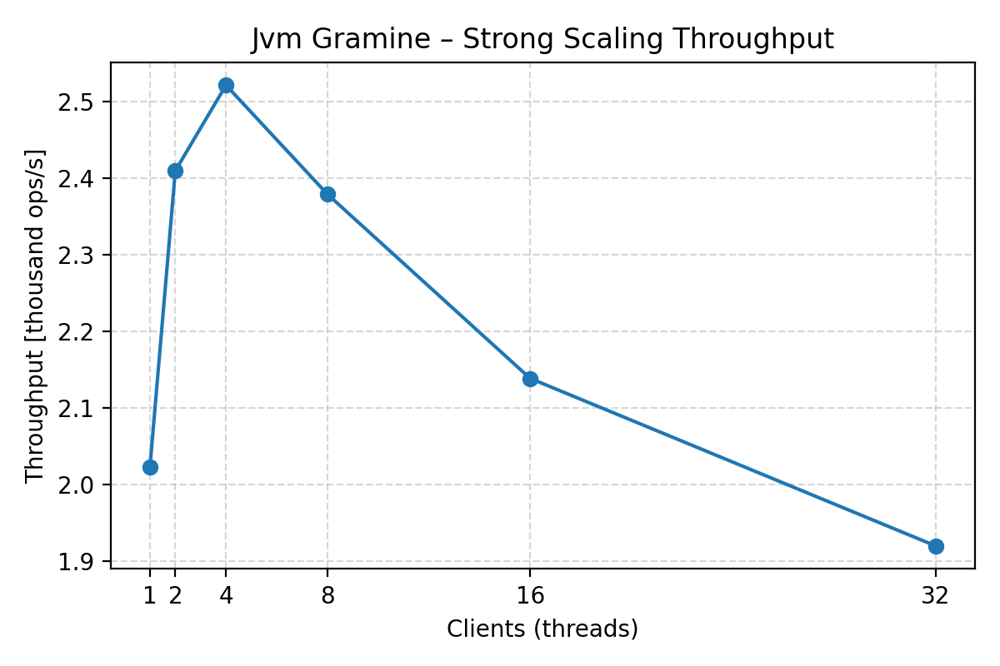
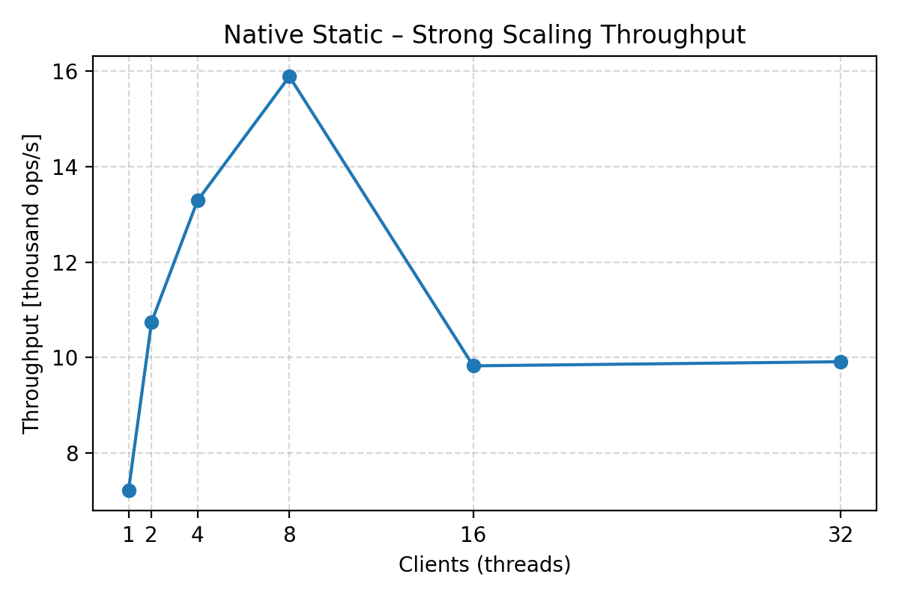
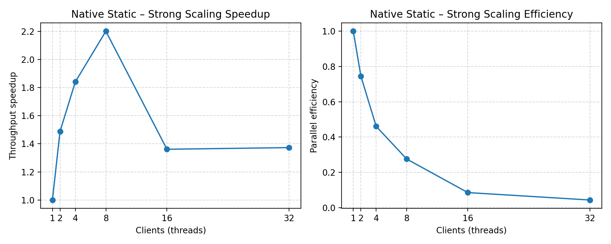
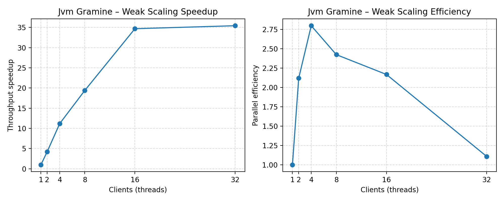
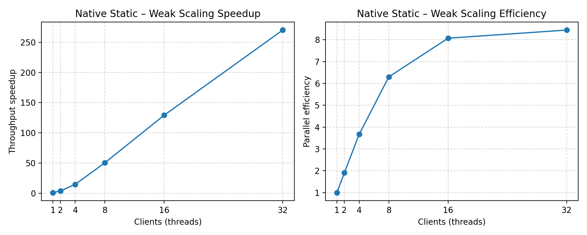

# Gramine Java Benchmark

Benchmark suite that evaluates a differentially private binary aggregation tree inside a Gramine-protected JVM. A TLS client streams floating-point values to the enclave; the server keeps the noisy private sum and exposes the familiar `initBinaryAggregation`, `addToBinaryAggregation`, and `getBinaryAggregationSum` calls. The layout mirrors the companion Java aggregation benchmarks so that results stay comparable while swapping Teaclave SGX for Gramine.

## Project Layout

- `src/server/` – TLS enclave server (`com.benchmark.gramine.enclave.BenchServer`) executed inside Gramine. Implements the command protocol (`INIT`, `ADD`, `GET`) and logs each ingestion for traceability.
- `src/server/com/.../dp/BinaryAggregationTree.java` – Gaussian-noise aggregation tree shared with the other benchmark suites to preserve behaviour.
- `src/client/` – Host harness (`com.benchmark.gramine.host.BenchClient`) that prepares workloads, drives weak/strong scaling runs, and prints JSON metrics.
- `tools/run-benchmarks.py` – Automation wrapper that builds each server variant, runs the client once, and writes combined CSV/JSON artifacts under `scaling-results/<timestamp>/`.
- `tools/generate_plots.py` – Turns the CSV/JSON outputs into PNG plots (per-variant throughput, speedup/efficiency, and startup-time comparisons).

## Benchmark Approach

Each benchmark execution follows three phases that align with the companion Teaclave suite:

1. **Baseline workload** – The client uses `GRAMINE_BENCH_DATA_SIZE` with the smallest requested thread count to derive the per-thread workload. A short warmup runs before measurements.
2. **Weak scaling** – The number of worker threads increases while the per-thread workload remains fixed.
3. **Strong scaling** – The total workload stays fixed while the number of worker threads increases.

The client prints JSON summaries for all phases so downstream plotting scripts can consume the output directly.

## Results

Example dataset: `scaling-results/20251030_004543/` (data size = 1024, sigma = 0.5, warmup = 3, measure = 5). The run compares three server variants executed through Gramine: `jvm-gramine`, `native-dynamic`, and `native-static`. Artifacts land in `scaling-results/<timestamp>/` and plots in `plots/`.

### Strong Scaling

Throughput scales from a single client up to 16 clients before Gramine scheduling overheads flatten the gains. Speedup and efficiency are highest for the native variants (`native-dynamic`, `native-static`), reaching ~5× speedup at eight clients. Refer to `plots/<variant>_strong_throughput.png` and `plots/<variant>_strong_speedup_efficiency.png` for the detailed traces.

#### JVM (Gramine)




#### Native (Dynamic)


#### Native (Static)





### Weak Scaling

Weak scaling stays close to linear: aggregate throughput increases steadily as threads are added, and the native variants show the largest improvements. See `plots/<variant>_weak_throughput.png` and `plots/<variant>_weak_speedup_efficiency.png`.

#### JVM (Gramine)




#### Native (Dynamic)


#### Native (Static)




### Startup Time

`plots/startup_times.png` summarises the bootstrap time for each server variant when launched through Gramine. Native images start faster than the JVM-backed variant once the enclave is provisioned.


### Reproducing the Figures

```bash
python -m venv .venv
source .venv/bin/activate
pip install --upgrade pip matplotlib numpy
python tools/generate_plots.py \
  --results scaling-results/20251030_004543/scaling_results.csv \
  --startup scaling-results/20251030_004543/benchmark_results.json \
  --output plots
```

## Getting Started

You can work from the host OS or inside the preconfigured devcontainer.

### Option 1: Devcontainer (recommended)

1. Install Docker and either the VS Code Dev Containers extension or the `devcontainer` CLI.
2. From the repository root run `task devcontainer` **or** open the folder in VS Code and choose “Reopen in Container”.
3. The container provisions GraalVM, Gramine, and the helper scripts automatically.

Convenient `go-task` entries:

| Task | Description |
|------|-------------|
| `task devcontainer` | Build, start, and attach to the devcontainer (wrapper around the tasks below). |
| `task devcontainer-up` | Start or reuse the devcontainer without attaching. |
| `task devcontainer-attach` | Exec into the running devcontainer shell. |
| `task devcontainer-down` | Stop and remove the container and volumes. |
| `task devcontainer-recreate` | Rebuild the container from scratch for a clean environment. |

### Option 2: Local Toolchain

Install the dependencies locally:

- GraalVM (JVM plus `native-image`)
- Gramine (`gramine`, `gramine-sgx`, `gramine-manifest`)
- GNU Make, Python 3.9+, and OpenJDK tooling

Clone the repository and continue with the build instructions below.

## Building

From the project root:

```bash
# Compile client/server classes
make server client

# Generate TLS certificates (if not already produced)
./tools/generate-certs.sh

# Optional: build GraalVM native images for the TLS server/client set
make APP_NAME=native-bench-dynamic STATIC_NATIVE=0 SGX=1 all
make APP_NAME=native-bench-static STATIC_NATIVE=1 SGX=1 all
```

`tools/run-benchmarks.py` runs `make clean` before each variant build so the benchmarks always start from a known baseline.

## Running Benchmarks

The automation wrapper builds the selected variants, launches the Gramine server, and drives one client run per variant:

```bash
python tools/run-benchmarks.py --variants jvm-gramine native-dynamic native-static
```

Key options:

| Option | Description |
|--------|-------------|
| `--variants <list>` | Limit the run to the specified variants. |
| `--all` | Execute all variants (default when no subset is provided). |
| `--output <dir>` | Override the target directory under `scaling-results/`. |

Each run produces:

- `scaling-results/<timestamp>/benchmark_results.json` – Startup metrics and per-variant summaries.
- `scaling-results/<timestamp>/scaling_results.csv` – Flattened metrics per variant and scaling mode.
- `scaling-results/<timestamp>/logs/*.out` / `*.err` – Raw client output (and stderr when present).

## Configuration

Defaults come from environment variables or an `.env` file at the repository root:

```
GRAMINE_BENCH_SIGMA=0.5
GRAMINE_BENCH_WEAK_SCALES=1,2,4,8,16,32
GRAMINE_BENCH_STRONG_SCALES=1,2,4,8,16,32
GRAMINE_BENCH_DATA_SIZE=1024
GRAMINE_BENCH_WARMUP=3
GRAMINE_BENCH_MEASURE=5
GRAMINE_BENCH_NATIVE_PARALLELISM=32
```

Apply them in one shot:

```bash
set -a
source .env
set +a
```

CLI flags override any setting (`java com.benchmark.gramine.host.BenchClient --help` lists all options).

## Collecting Metrics

Redirect the client output to capture the workload, weak scaling, and strong scaling summaries for custom post-processing:

```bash
python tools/run-benchmarks.py --variants native-dynamic > scaling-results/latest-run.json
```

The JSON contains per-pass throughput/latency measurements; the CSV is convenient for plotting tools that prefer tabular data.

## Plotting

After collecting metrics, generate the PNG figures:

```bash
python tools/generate_plots.py \
  --results scaling-results/<timestamp>/scaling_results.csv \
  --startup scaling-results/<timestamp>/benchmark_results.json \
  --output plots
```

The script writes:

- `plots/startup_times.png`
- `plots/<variant>_strong_throughput.png`
- `plots/<variant>_strong_speedup_efficiency.png`
- `plots/<variant>_weak_throughput.png`
- `plots/<variant>_weak_speedup_efficiency.png`

## References

- [Gramine Documentation](https://gramine.readthedocs.io/)
- [GraalVM Native Image](https://www.graalvm.org/native-image/)
